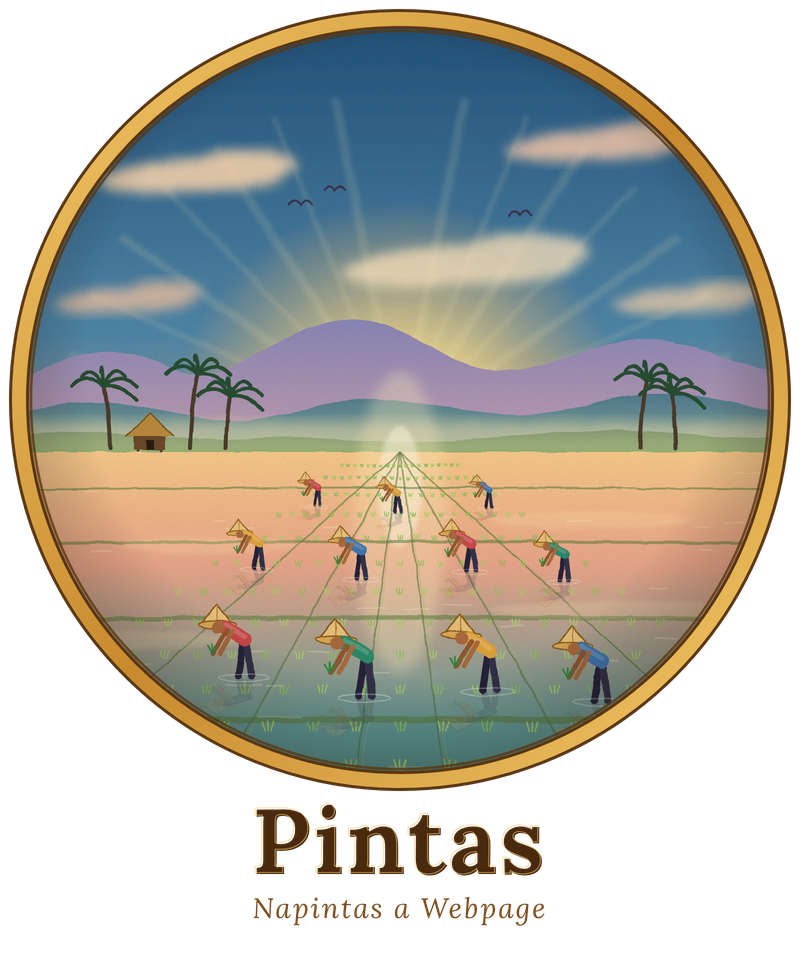

<p align="center">
  
</p>

# Pintas 0.6.1

**Pintas** is the **second Ilokano programming language**, and the **first
Ilokano programming language that specializes in building webpages for the
layman**. You write pages with Ilokano commands, and Pintas compiles them
into ordinary web pages.

**Created by James Kenneth Ines.** Pintas is his project, and the source
code carries his name as author.

The logo is a painting-style scene of farmers planting rice at sunrise. Like
rice, a page grows row by row from small, careful steps.

Pintas compiles `.pintas` files into ordinary `.html` files, so the result can be
opened by Chrome, Safari, Firefox, Edge, or another browser.

The goal: a common Ilokano speaker with no design background — and no
need to learn any syntax — should be able to produce a beautiful,
professional-looking, interactive webpage by clicking a toolbar and
picking a `tema` (theme) by name.

## Requirements

Python 3.9+. No pip installs needed for anything in this file,
including the editor and the live-preview server.

## Try it

**No syntax required — the editor GUI:**

```bash
python pintas.py hello.pintas --editor
```

Opens a browser tab with a toolbar (Heading, Paragraph, Button, Link,
Image, Container, Theme swatches, ...) on one side and a live preview
on the other. Click a toolbar button, it drops a ready-made line into
the text pane with the part you'd customize already selected — just
start typing to replace it. The preview updates automatically as you
type. Click **I-save** to write your changes back to the file. See
"The editor GUI", below.

**Know the commands and just want it to run — `--serve`:**

```bash
python pintas.py hello.pintas --serve
```

This compiles the page, opens it in your browser automatically, and
watches the file — edit `hello.pintas` in your own text editor, save,
and the open tab updates itself. Stop it with Ctrl+C.

**One-shot compile, no browser automation:**

```bash
python pintas.py hello.pintas
```

Then open `output/index.html` in your browser yourself.

## Commands

| Pintas | Meaning |
|---|---|
| `panid` | starts a page declaration |
| `ulo` | webpage title |
| `texto` | large heading |
| `subtexto` | smaller heading |
| `butangan` | paragraph |
| `pagpindutan` | button — add a second `"name"` to show/hide a `garrapon` |
| `silpo` | hyperlink — `http(s)://`, `mailto:`, `tel:`, `#anchor` or a relative page like `about.html`; other schemes (e.g. `javascript:`) are rejected |
| `ladawan` | image — a web URL, a `data:image/` URI, or a local file (copied next to the compiled page) |
| `ladawan-ulo` | the page's favicon (the small icon in the browser tab) — a `.svg`/`.png`/`.ico` file, a URL, or a `data:image/` URI; use it more than once to offer several formats |
| `kolor` | background color |
| `teksto-kolor` | text color |
| `tema` | apply a curated color theme (see below) |
| `tengnga` | center the page |
| `estilo` / `murdong` | advanced CSS block |
| `garrapon` / `murdong` | a container ("jar") that groups content — add a `"name"` to make it a toggle target |
| `immuna` / `murdong` | header band — a container like `garrapon`, rendered as a full-width hero strip |
| `udi` / `murdong` | footer — a container like `garrapon`, muted and set off by a top rule |
| `pagtudo` | small pill badge/label, e.g. `pagtudo "Baro!"` |
| `baga` | alert / notice box, e.g. `baga "Napateg a damag"` |
| `sao` | blockquote — add a second `"author"` for an attribution line |
| `pila` | short centered divider line |
| `banag` | bullet-list item — consecutive `banag` lines become one list |
| `bilang` | numbered-list item — consecutive `bilang` lines become one list |
| `naaramid` | checklist item (✓ marker) — consecutive `naaramid` lines become one list |
| `duakolum` / `murdong` | two columns side by side (stacks on phones) — put a `garrapon` in each column |
| `bidyo` | embedded YouTube video, e.g. `bidyo "https://youtu.be/aqz-KE-bpKQ"` (YouTube links only) |
| `saludsod` | FAQ item with question and answer, e.g. `saludsod "Ania ti Pintas?" "Maysa a simple a web language."` |
| `pagbilangan` | live countdown to an ISO 8601 date, e.g. `pagbilangan "2026-12-31T23:59:59" "Dandani"` (shows Aldaw / Oras / Minuto / Segundo) |
| `ladawanan` / `murdong` | responsive photo gallery container; put `ladawan` lines inside |
| `karusel` / `murdong` | swipeable picture carousel with arrows and dots; put `ladawan` lines inside (one per slide) |
| `mapa` | embedded Google Map, e.g. `mapa "Rizal Park, Manila"` — add a second `"zoom"` (1–21) if you like |
| `pagsuratan` | text input with label and optional placeholder, e.g. `pagsuratan "Naganmo" "Isurat ditoy"` |

### Control flow: `no` and `isuble`

Pintas 0.6.1 adds simple compile-time control flow for generated pages.

`no` means **if**. It accepts a value by itself or a comparison:

```text
no 5 > 3
butangan "Daytoy ket makita."
murdong
```

Supported comparisons are `==`, `!=`, `>`, `<`, `>=`, and `<=`. Quoted
values are also allowed:

```text
no "Pintas" == "Pintas"
texto "Napintas!"
murdong
```

`isuble` means **for/repeat**. The main form uses an Ilokano-style
range and includes both endpoints:

```text
isuble i manipud 1 agingga 3
butangan "Numero {{i}}"
murdong
```

This produces three paragraphs: `Numero 1`, `Numero 2`, and `Numero 3`.
The loop variable is written as `{{i}}`.

A step can be supplied with `addang`:

```text
isuble i manipud 2 agingga 10 addang 2
butangan "Numero {{i}}"
murdong
```

For simple repetition, use the numeric shorthand:

```text
isuble 3
butangan "Paulit-ulit"
murdong
```

`no` and `isuble` can be nested, including inside `garrapon` and other
Pintas containers. These constructs run while Pintas is compiling the
page, so the resulting HTML remains ordinary static HTML and does not
need a JavaScript runtime for the control flow.

### A note on the vocabulary

**Unverified additions:** `bilang`, `duakolum`, `bidyo`, `karusel` and
`mapa` are *constructed or borrowed* (`karusel` and `mapa` are loanwords; the
carousel's button labels `Napalabas` / `Sumaruno` are also unchecked), not checked against an Ilokano source
(`bilang` means "number/count", `dua` is "two"). Same policy as
`pagtudo`: flag better words and they are one-line swaps.

These are checked against real Ilokano, not just "sounds Ilokano":
`ladawan` and `tengnga` replaced earlier Tagalog versions (`larawan`,
`gitna`) once the correct Ilokano words were confirmed, and `kolor`,
`murdong`, and `pagpindutan` are direct corrections — `pagpindutan`
in particular resolves an earlier flag: the language originally used
`pindutan`, a false friend whose real Ilokano root `pídut` means "to
pick up / pilfer" rather than "button."

- `butangan` (paragraph) still couldn't be verified against a real
  Ilokano source either way — left as-is rather than risk "fixing" it
  wrong.

### Themes: `tema`

Colors, fonts, and spacing that clash is the main way a page made by
someone without a design background ends up looking amateurish rather
than intentional — even when every individual choice seemed
reasonable on its own. `tema` sidesteps that: instead of picking a
background color, a text color, and a font separately and hoping they
work together, one word applies a complete, pre-matched combination —
palette AND a curated Google Font pairing (a distinct heading font
plus body font per theme):

```text
tema "asul"
```

All nine theme names are real Ilokano words, checked the same way as
every command in this language — not just "sounds Ilokano." Six are a
palette + font pairing on the same shape as everything else — a safe,
coherent choice for most pages:

| `tema` | Look | Fonts |
|---|---|---|
| `puraw` | white — light, clean, default | Fraunces + Inter |
| `nangisit` | black — dark mode | Space Grotesk + Inter |
| `asul` | blue | Poppins + Source Sans 3 |
| `berde` | green | Lora + Nunito Sans |
| `duyaw` | yellow / gold | DM Serif Display + DM Sans |
| `labaga` | red | Oswald + Work Sans |

The other three change the *shape* too — button roundness, shadow
style, and heading treatment — not just the colors, so each reads as
a genuinely different design rather than a recolored template:

| `tema` | Look | Fonts |
|---|---|---|
| `rabii` (night) | near-black, glowing magenta accent, fully pill-shaped buttons, uppercase spaced-out headings | Orbitron + Rubik |
| `balitok` (gold) | warm black, gold accent with dark (not white) button text for real contrast, sharp 4px corners, wide letter-spacing | Playfair Display + Montserrat |
| `danum` (water) | soft aqua gradient background, frosted-glass translucent cards, fully rounded bubbly shapes | Quicksand + Karla |

`danum`'s background is an actual CSS gradient (not a flat color) —
the only theme that does this — and its cards use `backdrop-filter`
for a real glass effect; both gracefully degrade to a plain
background/card on very old browsers rather than breaking anything.
`balitok`'s dark button text isn't a style flourish — gold is too
light a color for white text to stay readable on, so the theme
overrides the button text color specifically rather than accepting
worse contrast just to keep every theme visually consistent.

An unknown theme name fails immediately with the list of valid ones,
rather than silently doing nothing. `kolor`/`teksto-kolor` still work
as before and override whatever `tema` set if they're written
afterward — `tema` is a starting point, not a lock. The fonts load
from Google Fonts, so `--serve`/the compiled page needs an internet
connection to display them (falls back to the system font if offline).

### Live preview: `--serve`

```bash
python pintas.py hello.pintas --serve
```

Compiles once, starts a small local server, opens the page in your
browser, and watches the source file. Every save triggers an
automatic recompile, and the open tab reloads itself within about a
second — no re-running the command, no manually refreshing. This is
the whole point: writing Ilokano and watching the page update, with
no other terminal command in the loop after the first one. Stop it
with Ctrl+C.

`--port 8000` is the default port; pass `--port 8080` (or any number)
if 8000 is already busy on your machine. No extra installs are
needed — the server and file-watching use only Python's standard
library.

### The editor GUI: `--editor`

```bash
python pintas.py hello.pintas --editor
```

This is Tier 2 of a three-tier idea: a plain split-view live editor
(type Pintas, see it render) would still require memorizing exact
syntax; a fully form-based builder would hide the language entirely
and stop being Pintas. This sits in between — a toolbar that *writes
correct Pintas for you*, so the syntax is always visible, always
correct, and never has to be memorized. If the file named on the
command line doesn't exist yet, it's created with a small starter
page so there's always something to see and edit immediately.

Every button is a hand-drawn SVG icon with a short label under it (hover
for the real Pintas command name). The icons are plain vector shapes, so
they look the same on every device instead of depending on its emoji
font, and they follow the toolbar's colors. On a narrow screen the toolbar
scrolls sideways. What each group does:

- **Panid / Ulo** — insert the page name / title line.
- **Dakkel a Ulo / Bassit nga Ulo / Parapo / Sao / Baga / Pagtudo** —
  heading, subheading, paragraph, quote, notice box and badge. Clicking
  inserts the line with placeholder text pre-selected — just type to
  replace it.
- **Banag / Bilang / Naaramid** — bullet, numbered and checklist items.
- **Silpo / Ladawan / Ladawanan / Bidyo / Karusel / Mapa** — link, image, photo
  gallery and carousel (each an open/close pair), YouTube video and Google Map.
- **Immuna / Dalan / Lalaem / Dua a Kolum / Udi** — header band,
  navigation bar, container, two columns and footer (each inserts an
  open/close pair with the cursor on the blank line between them),
  followed by **Pila** (divider) and **Itengnga** (`tengnga`).
- **Pagimbagan / Listaan / Ayab / Saludsod / Pagbilangan / Pagsuratan** —
  feature card, table (inserted with a header row and one data row),
  contact button, FAQ item, countdown and text input.
- **Ipakita/Ilemmeng / Buton** — a ready-made toggle: a `pagpindutan`
  wired to a matching named `garrapon`, auto-numbered so repeated clicks
  never collide (see "Interactive", below); and a plain button.
- **No / Isuble** — the control-flow blocks. They come with a small
  starter body, and the condition or range is pre-selected so you can type
  straight over it.
- **Kolor / Teksto-kolor / Estilo** — background color, text color and a
  raw CSS block.
- **Theme swatches** — nine colored circles, one per `tema`; click one
  to insert that exact `tema "..."` line.
- **Baro a Tema / Pattern / Pattern ti Lalaem / Baro a UI / Baro a Favicon** — the
  generators, below.
- **I-save** — writes the current text back to the real `.pintas`
  file on disk. Nothing is saved to disk until this is clicked.

The layout and icons live in `editor_toolbar.py`; adding a button is one
entry in its `GROUPS` list plus one icon in `ICONS`, and
`test_editor_toolbar.py` plus the main suite check that every button
inserts valid Pintas.

Every keystroke (debounced) and every toolbar click triggers a
recompile against the actual `pintas.py` compiler — not a separate
reimplementation — so the preview is always exactly what a normal
compile would produce, and a mistake shows a small red error message
above the preview (with the line number) rather than a blank or
broken page; the preview simply keeps showing the last valid render
until the mistake is fixed.

### Containers: `garrapon`

`garrapon` ("jar") opens a container that groups whatever comes after
it into one `<div class="garrapon">`, closed the same way as an
`estilo` block — with `murdong`:

```text
garrapon
texto "Card title"
butangan "Card body text."
murdong
```

Containers can nest (a `garrapon` inside a `garrapon`), and every
`garrapon` gets a default card-style look (padding, rounded corners,
a soft shadow) from the baseline stylesheet — style all of them at
once with `.garrapon { ... }` inside an `estilo` block. Forgetting
the closing `murdong` raises an error rather than silently mis-
compiling, the same as an unclosed `estilo` block.

Example:

```text
panid "Website Ko"
ulo "Pintas"

texto "Kablaaw!"
butangan "Napintas daytoy a webpage."
pagpindutan "I-click"
silpo "OpenAI" "https://openai.com"

kolor "lightblue"
tengnga
```

Or, for a coordinated look with no manual color picking:

```text
tema "berde"
tengnga
```

### Ready-made page pieces: `immuna`, `udi`, `pagtudo`, `baga`, `sao`, `pila`

Six small components that reuse the same machinery as everything else
rather than adding new mechanics — they're new *default looks*, not new
behavior, which is why they were cheap to add:

```text
immuna
texto "Naimbag a Bigat!"
subtexto "Header band"
murdong

pagtudo "Baro!"
baga "Napateg: agsarakka sakbay ti Biernes."
sao "Ti nakersang nga daculap, isut dalan ti pirac." "Optional author"
pila

udi
butangan "Copyright"
murdong
```

- **`immuna`** (header) and **`udi`** (footer) are containers exactly
  like `garrapon` — opened and closed with `murdong`, nestable, and
  optionally named so a `pagpindutan` can show/hide them. All three
  share **one** namespace, so `garrapon "x"` and `udi "x"` clash on
  purpose (they'd produce duplicate HTML ids otherwise). `immuna`
  stretches edge to edge to read as a real hero band.
- **`pagtudo`, `baga`, `sao`, `pila`** are single-line commands, no
  `murdong`. `sao` takes an optional second quoted argument for the
  author; `pila` takes none.
- Every one is themed through the same CSS variables as the rest of the
  page, so all of them re-color under any `tema` automatically — and the
  badge reuses `--pintas-button-text`, so it stays legible on light
  accents like `balitok`'s gold for the same reason buttons do.
- `baga` and `sao` stay left-aligned even when the page is `tengnga`
  (centered): a callout with a left bar and centered text looks broken,
  which showed up when the flagship example was rendered.

Vocabulary, checked the same way as everything else (dictionary sources,
not "sounds Ilokano"):

| Word | Meaning | Basis |
|---|---|---|
| `immuna` | first | Ilokano ordinal (also `umuna`); already used in this project's own sample text |
| `udi` | last / rear / hindmost | Austronesian Comparative Dictionary (Carro 1956; Rubino 2000) |
| `baga` | notice / announcement / bulletin | Austronesian Comparative Dictionary (Carro; Rubino) |
| `sao` | word / speech | Wiktionary (Ilocano), plus several independent sources |
| `pila` | line / row | Austronesian Comparative Dictionary (Carro; Rubino) — note it's most literally a *waiting line*, so as a "divider" it's a slight stretch |
| `pagtudo` | (badge/label) | **Constructed, not attested as a whole word:** `tudo` ("to point out, indicate") is dictionary-attested, and `pag-…` follows the same nominalizing pattern as `pagpindutan`. Flag it if a better word exists — it's a one-line swap |

### Carousel and map: `karusel`, `mapa`

```text
karusel
ladawan "foto1.jpg"
ladawan "foto2.jpg"
ladawan "https://picsum.photos/seed/pintas3/800/450"
murdong

mapa "Rizal Park, Manila"
mapa "7.0731,125.6128" "15"
```

- **`karusel`** is a container like `ladawanan`, closed with `murdong`, but it
  shows one picture at a time. Only `ladawan` lines are allowed inside (anything
  else fails with the line number), and `isuble` works inside it, so
  `isuble i manipud 1 agingga 6` + `ladawan "foto{{i}}.jpg"` makes six slides.
  Visitors can swipe, use the arrow buttons, click the dots, or press the
  left/right arrow keys; the arrows wrap around at both ends. The slides are a
  plain scroll-snap strip, so swiping still works with JavaScript off. A
  carousel with a single picture draws no arrows or dots. Local pictures are
  copied next to the compiled page, the same as `ladawan` anywhere else, and a
  carousel can be named (`karusel "galeria"`) to be a `pagpindutan` toggle target.
- **`mapa`** takes a place name, an address, or `latitude,longitude`, plus an
  optional zoom from 1 to 21. It uses Google's keyless embed, so the page stays
  one static file with no API key to manage, and it always includes a small
  "Ukat iti Google Maps" link underneath as a fallback. The place is typed
  exactly as written (accents like the `ñ` in `Peñablanca` are kept).
  Anyone opening a page with a `mapa` is loading Google's map, so Google
  receives that request the same way it does for `bidyo` and YouTube.
- Both are themed through the same CSS variables as everything else, so they
  re-color under any `tema`.

### Interactive: show/hide with `garrapon` + `pagpindutan`

Every button before this was decorative — it rendered but did
nothing when clicked. Naming a `garrapon` and pointing a
`pagpindutan` at that name makes it real: clicking the button shows
or hides that container, no JavaScript required to write it:

```text
pagpindutan "Ania ti Pintas?" "faq1"
garrapon "faq1"
butangan "Ti Pintas ket bassit a programming language."
murdong
```

A `garrapon` that's targeted this way starts hidden automatically —
that's what makes an FAQ answer, a "read more" panel, or a
mobile-nav menu work with zero extra syntax: the container it
belongs to just starts closed, and the button reveals it. A
`garrapon` nobody targets is completely unaffected and displays
normally, named or not. Two buttons can target the same name (an
"open" and a "close" button for one panel, say) — that's fine;
what's not fine is two *different* `garrapon` blocks sharing one
name, or a `pagpindutan` pointing at a name that no `garrapon`
declares — both fail immediately with the line number, the same
"loud rather than silently wrong" philosophy as every other error in
this language. Names are restricted to letters, numbers, `-`, and
`_` — this isn't a stylistic nicety, it's what makes the generated
`onclick` handler have zero escaping to get wrong and zero injection
surface: a name can never contain a quote or a parenthesis, so it
can never break out of the handler it's placed in.

The editor GUI's **Ipakita/Ilemmeng** ("Show/Hide") button inserts a
complete, correctly-named `pagpindutan`/`garrapon` pair in one click
(auto-numbered `detalye1`, `detalye2`, ... so repeated clicks never
collide), with the cursor left on the blank line ready to type the
content that should be hidden at first.

## What makes it a programming language?

The `.pintas` file is not HTML. `pintas.py` reads the Pintas
instructions, interprets them, and generates HTML/CSS.

That means we can keep expanding the language without requiring a browser
to understand Ilokano directly.

## Tests

A small pytest suite covers each command, all nine `tema` palettes and
font pairings (plus real CSS-parser validation and a WCAG contrast
check on `balitok`'s gold buttons — `pip install tinycss2` unlocks
that one check, everything else runs with just pytest), the show/hide
toggle (including its name-collision and injection-attempt checks),
`--serve`'s and `--editor`'s build/server helpers (including a real
HTTP round-trip against the editor's `/compile` and `/save`
endpoints; plus a test that pulls *every* editor toolbar button's
inserted text out of the real page and compiles it through the real
compiler, so a button can't drift out of sync with the language),
and error cases (unclosed `estilo`/`garrapon`, dangling
`murdong`, bad `silpo` syntax, unrecognized commands):

```bash
pip install pytest
pytest test_pintas.py test_editor_toolbar.py -v
```

`theme_generator.py` and `pattern_generator.py` (see "Generators,"
below) are separate software with their own separate test files —
`test_theme_generator.py` and `test_pattern_generator.py` — since
they're not part of the compiler this main suite covers:

```bash
pytest test_theme_generator.py test_pattern_generator.py -v
```

## Design

Every compiled page now starts from a built-in baseline: a real font
stack (no more default Times New Roman), comfortable line spacing, a
720px readable-width container, styled buttons/links, and a card-style
default look for `garrapon` containers — instead of bare browser
defaults. `tema` layers a complete, pre-matched color palette *and*
font pairing on top of that with one word (see Themes, above);
`kolor`, `teksto-kolor`, `tengnga`, and any `estilo` block can further
override it as needed. An empty `.pintas` file with just
`texto`/`butangan` now looks intentional instead of like a plain
unstyled document, and adding one `tema` line takes it from
generic-clean to a deliberately colored, typeset, coherent page —
without needing to know what a hex code or a font-family stack is.
`--serve` (above) removes the remaining terminal friction for someone
comfortable hand-editing a text file; `--editor` removes the syntax
itself as a barrier, for someone who isn't; naming a `garrapon` and
pointing a `pagpindutan` at it (above) is what makes the result
interactive rather than just good-looking.

## Future versions

Possible future commands:

- `lista` — lists
- more `ladawan` controls — sizing, alignment, captions
- a real `script` escape hatch, for anyone who *does* know
  JavaScript and wants more than show/hide
- `isurat` — a generic "write" command (not yet assigned a specific
  mechanic — flagging the word now, will implement once its role is
  clear)
- named variables (today only the `isuble` loop variable exists)
- reusable components (so a repeated card/section isn't retyped)
- forms
- animations (a fade or slide alongside the show/hide toggle, say)

## Generators: separate software, not part of `pintas.py`

Two standalone scripts that produce content *for* Pintas without being
part of the compiler itself - each run on their own, each tested on
their own (`test_theme_generator.py`, `test_pattern_generator.py`),
and neither one changes what `pintas.py` does.

### `ui_generator.py` - whole UIs named after Philippine mythical creatures

Press **Baro a UI** and get a complete, ready-to-use Pintas page. Each UI is
named after a documented creature of Philippine folklore (Ilokano, Tagalog
and Bisaya), or a hybrid of two: `Bakunawa`, `Ibong Adarna`,
`Bakunawa-adarna`. The creature steers the design (hue family, light or dark,
fonts, shape), and a hybrid mixes the two creatures' looks.

```
python ui_generator.py --gui                        # click-to-generate window
python ui_generator.py --seed 7 --count 3           # files in generated_ui/
python ui_generator.py --name Bakunawa-adarna       # choose the name
python ui_generator.py --list-names
```

Each result is a `.pintas` file plus the compiled `.html`. Palettes pass the
same contrast checks as `theme_generator.py` (plus links and button hover),
the background is a `pattern_generator.py` tile, every UI gets its own round
sigil, and images are built in (no external assets). The same seed always
gives the same UI. Names come from a curated list, never invented.
Tests: `test_ui_generator.py`.

The same generator is also a button in the editor (**Baro a UI**, under
Generators - see below), so you can generate a page and keep editing it in one
place. The button always picks a random creature; use the standalone window
or `--name` when you want to choose one.

### Generators inside the editor

The editor toolbar has a generator group, so no command line is needed:

| Button | What it does |
|---|---|
| **Baro a Tema** | Runs `theme_generator.py` and drops in a fresh, contrast-verified palette + font pairing. |
| **Pattern** | Runs `pattern_generator.py` and adds a kusikus-style tiled background to the page (`body`). |
| **Pattern ti Lalaem** | Same, but tiles the background of every `garrapon` instead. |
| **Baro a UI** | Runs `ui_generator.py`: a complete page named after a Philippine mythical creature (or a hybrid of two), with its own palette, pattern, sigil, favicon and layout. Unlike the four other buttons this **replaces the whole editor text** - see below. |
| **Baro a Favicon** | Runs `favicon_generator.py`: a monogram of the page title's first letter in the last generated theme's accent color, added as `ladawan-ulo` lines with the icons embedded. |

Each click rolls a new random seed and *replaces* the previous generated
block (they sit between `# >>> tema-generator` / `# <<< tema-generator`
comment lines), so the file doesn't fill up with old attempts. Keep one
you like by deleting its comment lines. A generated theme has no name yet,
so it is written as the shipped `tema` with the same fonts plus an
`estilo` block overriding the colors and shapes; the pattern buttons reuse
the last generated theme's colors. Naming a theme properly remains a manual step.

**Baro a UI works differently from the other four**, because it writes a whole
page rather than a block to drop in:

- It replaces everything in the editor in one step, so **Undo** (or Ctrl+Z)
  brings your previous text straight back, and **Redo** returns the generated page.
- If the editor holds anything other than an untouched generated UI, it asks
  first (OK / Cancel). Clicking it again on a UI you haven't touched just rolls a
  new one with no question, so re-rolling is one click. Once you edit the
  generated page it asks again.
- Nothing is written to your file on disk until you press **I-save**.
- Afterwards, **Pattern** and **Baro a Favicon** use the generated UI's accent
  and background colors (the favicon takes its title from the page), the same
  way they follow **Baro a Tema**.
- It's also in the online playground (`docs/`), since `build_playground.py`
  now ships `ui_generator.py` with the other generator files.

### `theme_generator.py` — autonomous palette proposals

```bash
python theme_generator.py --seed 42 --count 3 --preview
```

Proposes new `tema` candidates using real color theory (a random base
hue plus a scheme — monochromatic/analogous/complementary/triadic),
picks a font pairing and a shape preset from small curated pools (so
"autonomous" doesn't mean "unconstrained" — the same reasoning as the
Truchet-tile rules below, rather than free-hand), and — this is the
part that matters — actually **verifies** every candidate the same
way `balitok`'s gold-button fix did: text-on-background and
muted-on-background are nudged until they clear real WCAG contrast
ratios, and button text automatically picks whichever of white or
near-black has better contrast against the generated accent, rather
than assuming white the way the original six themes did before that
bug was found. A candidate that can't be made to pass gets rejected
and skipped, not shipped anyway — verified directly: across 30 test
seeds, several fail on purpose and are correctly dropped.

`--preview` renders each surviving candidate through the *real*
`compile_pintas()` (temporarily registered, not a separate mockup) so
you see an actual Pintas page, not just hex codes. Every sample run
during development was checked two ways before being trusted: parsed
with a real CSS parser (`tinycss2`) for zero syntax errors, and
rendered to an actual image and looked at — not assumed.

What it deliberately does *not* do: name the result. Every real theme
name Pintas ships is a checked Ilokano word; a script guessing
plausible-sounding syllables isn't a substitute for that lookup, so
a generated entry is emitted as `"candidateN"` with a comment saying
it needs a real name before it's added to `pintas.py`'s `THEMES` —
that step stays human.

### `favicon_generator.py` — favicons for your pages

Makes the little icon shown in the browser tab. Each favicon is a round or
rounded-square badge in your accent color with either a **monogram** (the
first letter of the page title, built from a 5x7 grid of squares like
cross-stitch) over a faint kusikus weave, or the **sigil** alone (the weave,
bold). The weave is the same Truchet-tile family as `pattern_generator.py`.

```
python favicon_generator.py --title "Bakunawa" --accent "#2563eb"
python favicon_generator.py --title "Pintas" --style sigil --seed 7
python favicon_generator.py --title "Pintas" --data-uri
```

It writes `favicon.svg`, `favicon-16/32/48.png` and a multi-size
`favicon.ico`, and prints the Pintas lines that use them:

```
ladawan-ulo "favicon-32.png"
ladawan-ulo "favicon.svg"
```

Keep the icon files next to the page (`pintas.py` copies them into the output
folder, the same as `ladawan` images). With `--data-uri` the icons are
embedded in the `.pintas` file instead, so there is nothing to copy. It is
pure standard library (its own small PNG renderer, no Pillow), the letter is
always at least 4.5:1 contrast against the badge (mid-tone accents are
nudged lighter or darker to get there), and the same seed gives the same
icon. Tests: `test_favicon.py`.

**About the command name.** `ladawan-ulo` is **constructed**: `ladawan`
(picture) + `ulo` (head/title), both already in Pintas. I could not confirm an
established Ilokano word for "favicon", so this is a placeholder in the same
spirit as `pagsuratan` and `ladawanan`; if you know a better word, changing it
is one string in `pintas.py` (plus the editor keyword list and toolbar).

The generated UIs from `ui_generator.py` include a monogram favicon of their
name's first letter.

### `pattern_generator.py` — kusikus-inspired tileable backgrounds

```bash
python pattern_generator.py --seed 7 --size 6 --line "#2563eb" --bg "#f0f6ff"
```

Generates a seamless, tileable background pattern inspired by
**kusikus**, a real geometric motif from Ilokano *abel/inabel*
weaving — undulating square grids historically woven (via a technique
called *binakol*) to visually suggest whirlpools. This doesn't
attempt to reproduce actual loom mechanics; it uses **Truchet tiles**,
a genuine 17th-century mathematical technique for exactly this kind
of flowing grid pattern, which is why an algorithm can generate new
ones convincingly instead of each one needing to be hand-drawn.

Each grid cell gets one of two mirrored quarter-circle-arc tiles,
chosen randomly; because every tile variant touches the midpoint of
all four of its own edges, adjacent tiles always connect regardless
of which variant either one is — that's what turns a grid of
disconnected arcs into continuous flowing curves. This was verified
by actually rendering it, not just trusted from the geometry: a
single tile set, and separately a 3×3 repetition of that same tile
set as a real CSS `background-repeat`, were both rendered to images
and inspected — no visible seam at any repeat boundary.

Output is a standalone `.svg` file plus a ready-to-paste Pintas
`estilo` block using a base64 data URI (no external image file to
keep track of, consistent with the rest of this project). That exact
snippet was fed into a real `.pintas` file and compiled through the
actual `pintas.py`, end to end, confirming the generator's output is
usable as-is, not just plausible-looking text. `--for-garrapon`
targets `.garrapon` instead of `body`, for a patterned card rather
than a patterned page.

One practical note: a busy pattern directly behind long paragraphs of
text can hurt readability — it reads better as a page or hero
background with a `garrapon` card (solid background) holding the
actual body text on top, rather than putting text straight onto the
pattern.


### Command names changed in 0.6 (English/Tagalog → Ilokano)

| Old | New | Basis |
|---|---|---|
| `link` | `silpo` | Ilokano word for a link/connection |
| `faq` | `saludsod` | Ilokano "question"; already used in the error messages |
| `textbox` | `pagsuratan` | `surat` (write) + `pag-…-an`, same pattern as `pagpindutan` — **constructed** |
| `countdown` | `pagbilangan` | `bilang` (count) + `pag-…-an` — **constructed** |
| `nabigasyon` | `dalan` | "road/path" (Ilokano word list, ABVD) |
| `galeria` | `ladawanan` | `ladawan` + `-an` (place of pictures) — **constructed** |
| `pasilidad` | `pagimbagan` | benefit/advantage, from `imbag` (good) |
| `talaan` / `tala` | `listaan` / `ringgor` | table / row; `listaan` is used on the Ilokano Wikipedia |
| `kontak` | `ayab` | "call/invite" |
| `punto` | `banag` | "thing/item" |
| `tsek` | `naaramid` | "done/accomplished" |

Error messages that were in Tagalog (`Hindi ko maawatan`, `na walang
kaparehas`) are now Ilokano (`Diak maawatan`, `nga awan ti kaparehas`),
and the countdown labels read Aldaw / Oras / Minuto / Segundo. The old
words are no longer accepted. CSS class names follow the new command
names (`pintas-saludsod`, `pintas-pagbilangan`, ...), so any `estilo` block
that targeted the old ones needs updating. `texto`, `subtexto`, `estilo`,
`kolor`, `teksto-kolor`, `tema`, `bidyo` and `duakolum` were left as they
were: they are Spanish-origin loans that were already part of the language.

## New page components (Pintas 0.4)

Pintas now includes common website building blocks:

```text
dalan
silpo "Umuna" "#umuna"
silpo "Kontak" "#kontak"
murdong

pagimbagan "Napardas" "Simple and fast."
pagimbagan "Napintas" "Styled as a feature card."

listaan
ringgor "Plano" "Presyo"
ringgor "Basic" "Libre"
ringgor "Pro" "₱499"

ayab "Email Us" "mailto:hello@example.com"
ayab "Call Us" "tel:+639000000000"
```

- `dalan ... murdong` creates a responsive sticky navigation bar; `silpo` lines inside it become navigation links.
- `pagimbagan "titulo" "deskripsion"` creates a feature card.
- `listaan` followed by `ringgor "cell" "cell" ...` creates a responsive information/pricing table. The first `ringgor` is the header row.
- `ayab "nagan" "target"` creates a contact/action button. Targets may be `https://`, `http://`, `mailto:`, or `tel:`.

## License

Pintas is released under the MIT License. See `LICENSE`.

## Credits

Pintas is the project of **James Kenneth Ines**: the language, the compiler,
the editor, the generators and the logo.

- **Logo:** `assets/pintas-logo.svg` (scalable) and `assets/pintas-logo.png`.
  It shows farmers planting rice at sunrise, in a painting style.

## Online playground (GitHub Pages)

`python build_playground.py` builds `docs/`, a static copy of the editor that
runs the real compiler in the browser through [Pyodide](https://pyodide.org)
(no server needed). Commit `docs/`, then on GitHub go to **Settings → Pages →
Build and deployment → Deploy from a branch → `main` / `/docs`**. Re-run the
build script after changing `pintas.py`, the generators or the toolbar.

## Windows app (no Python needed)

Push a version tag and GitHub builds `Pintas.exe` for you
(`.github/workflows/windows-exe.yml`, PyInstaller on a Windows runner):

    git tag v0.6.2
    git push origin v0.6.2

The exe appears under **Releases**. Double-click it to open the editor on
`Documents\Pintas\panid.pintas`; drop a `.pintas` file onto it to edit that
file; or use it as the normal command-line compiler
(`Pintas.exe site.pintas output\index.html`). Windows may show a "Windows
protected your PC" warning because the exe isn't code-signed - click **More
info → Run anyway**.

## Project layout

- `pintas.py` - the compiler and command line (`pintas.py site.pintas out/index.html`).
- `pintas_editor.py` - the browser editor (page, syntax highlighting, live preview, save). `--editor` loads it on demand; the compiler never imports it otherwise.
- `editor_toolbar.py`, `theme_generator.py`, `pattern_generator.py` - toolbar buttons and the theme/pattern generators the editor uses.
- `favicon_generator.py` - the standalone favicon maker (SVG, PNG and ICO; `ladawan-ulo` snippets).
- `editor_icon.py` - the editor's own tab icon (the rice-field emblem from the logo, as data URIs); the files are in `assets/favicon-*.png` and `assets/favicon.ico`.
- `ui_generator.py` - the standalone creature-named UI generator (`--gui` for the click-to-generate window).
- `pintas_app.py` - the double-click launcher used for `Pintas.exe`.
- `build_playground.py` - builds the GitHub Pages playground into `docs/`.
